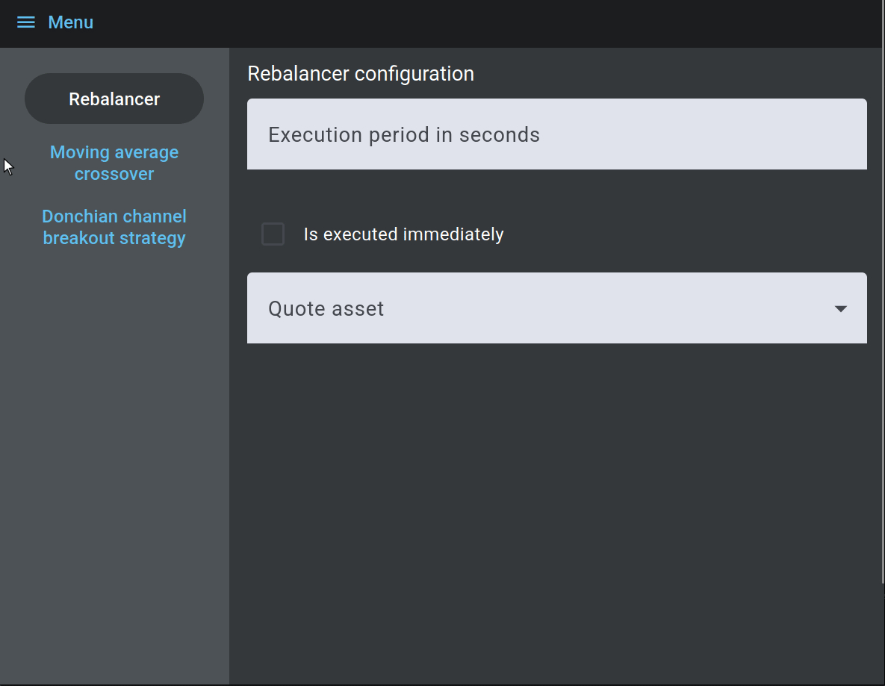
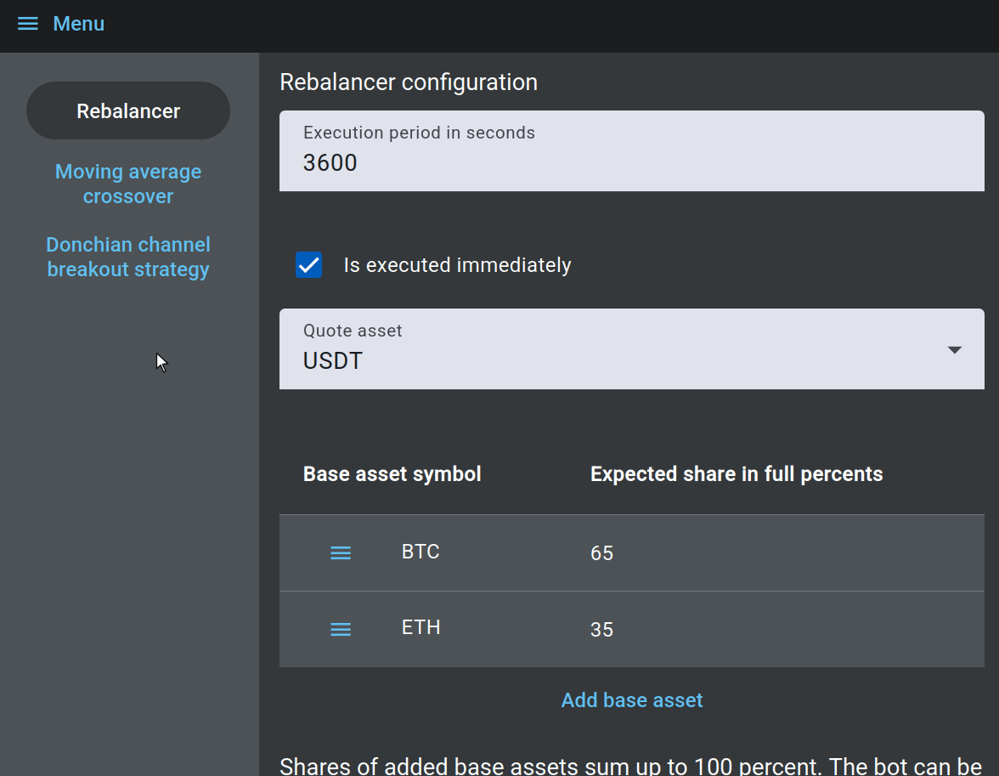
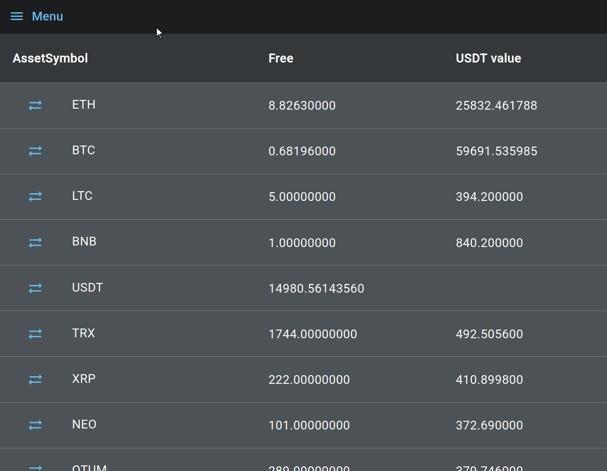
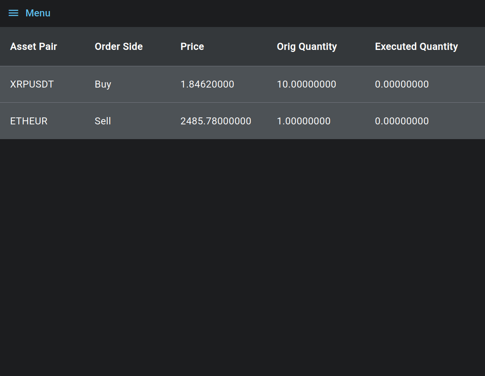

# Quant Trade Studio


## Overview

Quant Trade Studio is a multi-strategy trading engine for Binance with an Angular UI.

The main goal is to provide a platform for development and testing of new algorithms.

## Features

- Parametrizing and starting bots

  

  Currently available bots are:

  - Rebalancer - maintains configured value proportion of owned assets

  - Moving average crossover - see [wikipedia](https://en.wikipedia.org/wiki/Moving_average_crossover)

  - Donchian channel breakout strategy - see [wikipedia](https://en.wikipedia.org/wiki/Donchian_channel)

- Backtesting bots

  

- Browsing owned assets and manually placing orders at market price

  

- Browsing open orders

  

## Tech stack

| Layer    | Technology             | Libraries                  |
| -------- | ---------------------- | -------------------------- |
| Backend  | C++20                  | Crow, libcurl, Google Test |
| Frontend | Angular/TypeScript     | -                          |
| Testing  | Python                 | Behave, Selenium, Flask    |
| DevOps   | Docker, GitHub Actions | -                          |

For more implementation details see [doc/Architecture.md](doc/Architecture.md).

## Getting started

### Prerequisites

- Install Docker and Docker Compose on your system
- Build Docker images:
  ```
  ./scripts/build_docker_images.sh
  ```
- Setup Binance testnet keys:
  1. Generate keys at <https://testnet.binance.vision/>
  2. Save the API key to [keys/apiKey.txt](keys/apiKey.txt) and the secret key to [keys/secretKey.txt](keys/secretKey.txt)

**Important Security Notice:** This project is designed exclusively for use with Binance testnet credentials. Under no circumstances should production API keys be used with this software.

### Building and running (development)

1. Build backend:

   ```
   ./scripts/build_backend_in_docker.sh
   ```

2. Execute
   ```
   ./scripts/run_devel.sh
   ```

This should start both backend and frontend. The frontend should be accessible on `localhost:4200`.

### Building and running (in VS Code)

1. Download VS Code Dev Containers extension and open VS Code inside the backend's Docker container using [.devcontainer/devcontainer.json](.devcontainer/devcontainer.json) configuration. See more here: <https://code.visualstudio.com/docs/devcontainers/containers>
2. Execute task "Build debug" defined in [.vscode/tasks.json](.vscode/tasks.json) (this is the default task, so you can just click Ctrl + Shift + b)
3. Execute "Launch main debug" debug config defined in [.vscode/launch.json](.vscode/launch.json) (this is the default debug config, so you can just click F5)
4. In a separate command line execute:
   ```
   ./scripts/run_frontend_in_docker.sh
   ```

Now you can use gdb debugger in VS Code.

### Running automatic tests

- Backend unit tests:

  ```
  ./scripts/run_backend_unit_tests.sh
  ```

  - Alternatively, use VS Code Dev Containers extension to open IDE inside the backend container and execute "Launch unit tests" from [.vscode/launch.json](.vscode/launch.json) to be able to use the debugger.

- Frontend unit tests
  ```
  ./scripts/run_frontend_unit_tests.sh
  ```
  - Alternatively, execute task `test` from [frontend/package.json](frontend/package.json) to be able to use the browser's debugger.
- Backend component tests
  ```
  ./scripts/run_backend_component_tests.sh
  ```
- E2E tests
  ```
  ./scripts/run_e2e_tests.sh
  ```

You can also find other scripts used by the CI pipeline configurations: [.github/workflows](.github/workflows)

## Future plans

- Add running bots dashboard with parameters, history, and stop controls
- Improve existing bots:
  - Add configurable weight options for moving average crossover
  - Add volume filtering to Donchian channel breakout to reduce false signals
- Add more trading bots
- Extend backtest results with graph visualizations and more metrics
- Add possibility to cancel active order from orders page
- Add search to long GUI selection lists

## Resources

- [Binance testnet API documentation](https://developers.binance.com/docs/binance-spot-api-docs/rest-api/general-api-information). Quant Trade Studio uses api/v3.

- [Crow library guide](https://crowcpp.org/master/guides/app/)

## License

This project is licensed under the MIT License - see the [LICENSE](LICENSE.md) file for details.

## Disclaimer

This project is provided for educational and demonstration purposes only. It is not financial advice and is not intended for live trading.

The author makes no guarantees of performance, profitability, or accuracy, and accepts no liability for any losses arising from the use of this software. Use at your own risk.
